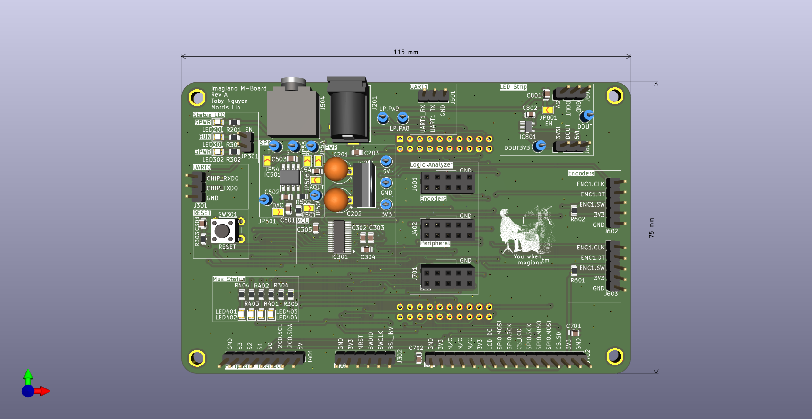
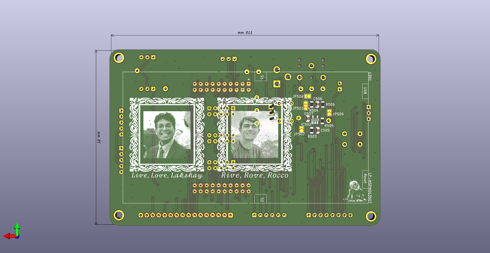
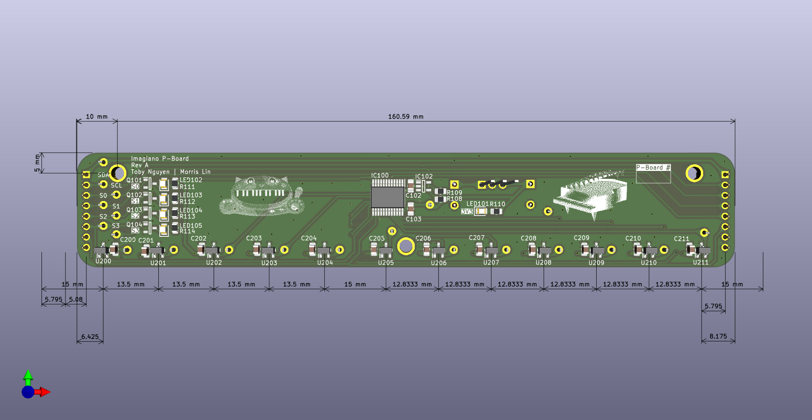
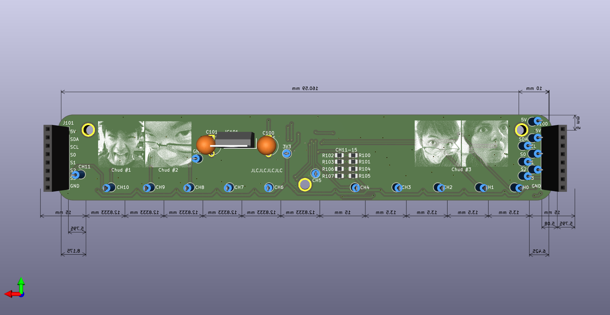

# Imagiano | Digital Synthesizer Project
Brought to you by...
[@jeffchang0](https://github.com/jeffchang0)    
[@MorrisYLin](https://github.com/MorrisYLin)    
[@zaarabilal](https://github.com/zaarabilal)    
[@tguyenn](https://github.com/tguyenn)    

We decided to build a digital synthesizer/piano for our final project in UT Austin's Embedded Lab Class! We thought a piano was a great idea since we all love music, and a digital synthesizer presented a good deal of programming and electrical challenges.

TODO: insert picture of finished product? embed video of jegery playing pinoa
<!-- The most reliable method is to use the GitHub web interface to generate a hosted asset link: 
Edit your README.md on GitHub.com.
Drag and drop your video file (up to 100MB) directly into the editor pane.
Wait for the upload to complete; GitHub will automatically generate a specialized Markdown link (e.g., https://github.com...).
Preview and save your changes. The video will now appear as an inline player with sound controls.  -->
test (replace this): https://github.com/user-attachments/assets/3ec2cc7f-7ef4-4a84-a22f-b311950bbfaf

Our digital piano consists of    
1.) A main controller board  
2.) A series of peripheral boards  
3.) Piano keys with magnets  
4.) Piano enclosure     
    
... all from scratch!

## Table of Contents
TODO: insert toc

## System Design
Figuring out requirements is by far the most important part of a project! Of course you have to know what you are building before you build it :)

We knew we wanted to make a piano of a larger scale, so we had to figure out how to seamlessly connect a lot of keys together.

After some thinking and debate, we came down to this diagram for our overall system design:    

We opted to have a main controller board daisy-chained with a series of peripheral boards. This main board would also be connected to user interfaces like an LCD, digital rotary encoders, and an addressable LED strip.        

TODO: fix text rendering on some of these lol

  

Each peripheral board would have an array of linear Hall effect sensors to determine key position, with 12 of these sensors to form an octave. 5 of these peripheral boards allowed us to cover a good range of pitches!  
       
TODO: fix hall sensor 1 duplicate

  

## Electrical Design
Once we had planned out the high-level details of the project, it was time to figure out what electrical connections needed to be made. First, it was time to go window shopping and datasheet diving on Mouser to figure out what we were even working with.

Once we had picked out all our parts, we drew out the schematic (and all of the relevant subsheets):    

<table>
  <tr>
    <td></td>
    <td></td>
  </tr>
  <tr>
    <td colspan="2" align="center">
      <em><b>Rev A -</b>  Main (Left) and Peripheral (Right) Schematics</em>
    </td>
  </tr>
</table>

TODO: talk about spi vs i2c bus

TODO: talk about why we put an LDO on every peripheral board

TODO: talk about why we have leds on select lines

TODO: talk about why we incorporated a launchpad into our design versus just bare MCU

TODO: talk about why we didnt create our own amp/speaker circuit and decided to just use line output to an external speaker

TODO: talk about through hole components

After verifying the schematic, we moved onto laying out the PCB itself:
<table>
  <tr>
    <td></td>
    <td></td>
  </tr>
  <tr>
    <td colspan="2" align="center">
      <em><b>Rev A -</b> Front and back main board</em>
    </td>
  </tr>
</table>

<table>
  <tr>
    <td></td>
    <td></td>
  </tr>
  <tr>
    <td colspan="2" align="center">
      <em><b>Rev A -</b> Front and back peripheral board</em>
    </td>
  </tr>
</table>

TODO: talk abt limitation to 2 layers due to budget constraints, also 4 layers overkill since low speed signals

TODO: talk about connectors between peripheral boards

## Mechanical Design

TODO: @jeffchang0 cad models pictures?

TODO: @jeffchang0 mechanical design challenges

TODO: talk about mass manufacturing of keys
    - shoutout "tiw"

## Firmware Design

TODO: @MorrisYLin @zaarabilal pls

talk about what modules we were to use, drivers we had to make, coding practices, etc

## implementation challenges
- jumpers!
- never trust anything. everything is a lie
    - pinout for onboard MSPM0 MCU was wrong on one rail, so we had to bluewire many pins
    - pinout for dc barrel jack was also wrong, so had to desolder and use a flying screw terminal setup
    - pulled reset pin to the wrong polarity, so had to cut a trace
- competition restricted us to writing everything without using TI's beloved Syscfg, so we had to figure out module initialization code by ourselves
- magnet strength
    - magnet polarity pulling adjacent keys
    - hall sensor voltage swing amplitude not big enough

## Rev A Credits
@jeffchang0 - Mechanical design/fabrication
@MorrisYLin - DAC firmware, DSP firmware, PCB design    
@zaarabilal - I2C ADC driver, ST7735/KY-040 encoder drivers, Mechanical design    
@tguyenn - PCB design/assembly, WS2812B LED driver, Documentation    

## Rev B motivation and features
Due to time and budget restrictions, we weren't able to cleanly implement all of our features. We didn't like that, so we decided to spin a new revision of the main board to add and fix some features.

Some of these features include:
- Replace MSPM0G3507 with dual core microcontroller to properly handle the math compute load, sound output, LED output, and user interface
- Removed backpack devkit
- SD card for loading in graphics and differnet preset sound configs??
- Cleaned audio output circuit
- Silkscreen art!
- Replaced all through-hole with SMD
- Replace all LDO with switching regulator
- black silkscreen + enig because i love burning money

coming soon...™️ 

# Rev B Electrical Design
# Rev B Credits
