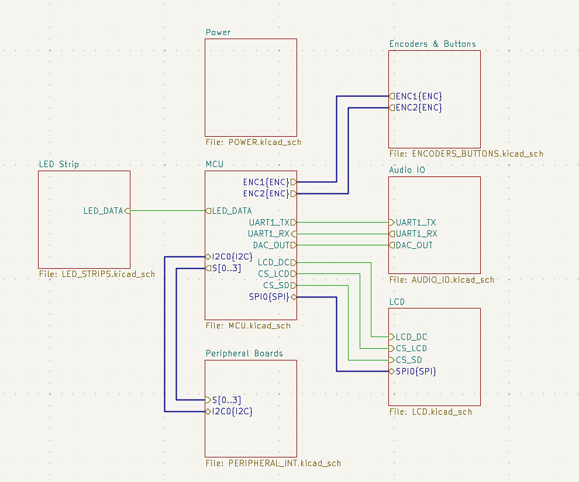

# Imagiano
Brought to you by
@jeffchang0
@MorrisYLin
@zaarabilal
@tguyenn

We decided to build a digital synthesizer/piano for our final project in UT Austin's Embedded Lab Class competition! We thought a piano was a great idea since we all love music, and a digital synthesizer presented a good deal of programming and electrical challenges.

TODO: insert picture of finished product? embed video
<!-- The most reliable method is to use the GitHub web interface to generate a hosted asset link: 
Edit your README.md on GitHub.com.
Drag and drop your video file (up to 100MB) directly into the editor pane.
Wait for the upload to complete; GitHub will automatically generate a specialized Markdown link (e.g., https://github.com...).
Preview and save your changes. The video will now appear as an inline player with sound controls.  -->

Our digital piano consists of    
1.) A main controller board  
2.) A series of peripheral boards  
3.) Piano keys with magnets  
4.) Piano enclosure  
... all from scratch!

# System Design
- figuring out requirements is the most important part of a project!
- figure out what the hell were doing
- somehow interface with a **LOT** of keys

## Electrical Design
- show schematic

- limitation to 2 layers due to budget constraints, also overkill for 4 layers since low speed signals

## Mechanical Design

TODO: @jeffchang0 cad models?

## system design challenges
- budget
    - through hole components
- mass manufacturing of keys
    - shoutout "tiw"

## implementation challenges (things we learned)
- jumpers!
- never trust anything. everything is a lie
    - pinout for onboard MSPM0 MCU was wrong on one rail, so we had to bluewire many pins
    - pinout for dc barrel jack was also wrong, so had to desolder and use a flying screw terminal setup
    - pulled reset pin to the wrong polarity, so had to cut a trace
- competition restricted us to writing everything without using TI's beloved Syscfg, so we had to figure out module initialization code by ourselves

## Rev A 
Here are our main and peripheral board designs for our first revision!    

<table>
  <tr>
    <td></td>
    <td></td>
  </tr>
  <tr>
    <td colspan="2" align="center">
      <em><b>Figure 1:</b> Front and back main board (Rev A)</em>
    </td>
  </tr>
</table>

<table>
  <tr>
    <td></td>
    <td></td>
  </tr>
  <tr>
    <td colspan="2" align="center">
      <em><b>Figure 2:</b> Front and back peripheral board (Rev A)</em>
    </td>
  </tr>
</table>

## Rev A Credits
@jeffchang0 - Mechanical design/fabrication
@MorrisYLin - DAC Audio firmware, DSP firmware, PCB design    
@zaarabilal - I2C ADC driver, ST7735/KY-040 encoder drivers, Mechanical design    
@tguyenn - PCB design/assembly, WS2812B LED driver, Documentation    

## Rev B motivation and features
Due to time and budget restrictions, we weren't able to cleanly implement all of our features. We didn't like that, so we decided to spin a new revision of the main board to add and fix some features.

Some of these features include:
- new dual core microcontroller to properly handle the math compute load, sound output, LED output, and user interface
- removed backpad devkit
- SD card for loading in graphics and differnet preset sound configs??
- Cleaned audio output circuit
- Silkscreen art!
- replaced all through-hole with SMD

coming soon...™️ 

# Rev B Electrical Design
# Rev B Credits