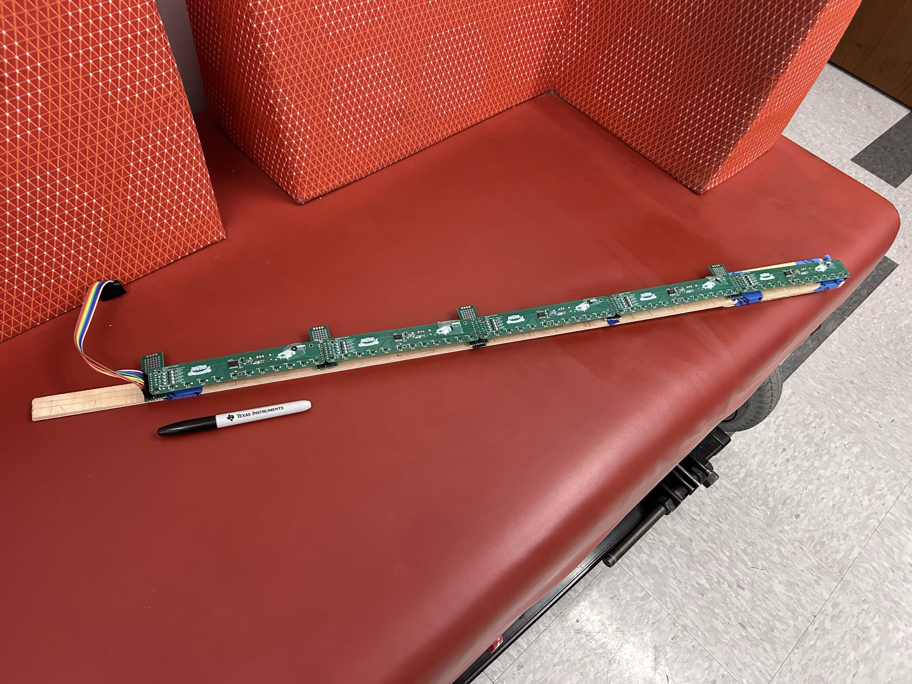

# Imagiano | Digital Synthesizer Project

## $$\color{#CC5500} \text{UT ECE445L Competition Project}$$

Brought to you by...    
[@jeffchang0](https://github.com/jeffchang0)    
[@MorrisYLin](https://github.com/MorrisYLin)    
[@zaarabilal](https://github.com/zaarabilal)    
[@tguyenn](https://github.com/tguyenn)    

## Introduction

We decided to build a digital synthesizer/piano for our final project in UT Austin's Embedded Lab Class! We thought a piano was a great idea since we all love music, and a digital synthesizer presented a good deal of electrical, mechanical, and programming challenges.
  
Our digital piano consists of    
1.) A main controller board  
2.) A series of peripheral boards  
3.) Piano keys with magnets  
4.) Piano enclosure     
    
... all from scratch!  
  
Here's a clip of our project (Rev A) in action, credit to [@jeffchang0](https://github.com/jeffchang0):
> [!IMPORTANT]
> Please <ins>__enable audio__</ins> and applaud the ~~mouth~~camerawork for the full demonstration!  

  <video src="https://github.com/user-attachments/assets/4a25433e-0272-4781-a5fd-c7f0d65e424b" width="300" controls>
  </video>

## Table of Contents
1. [System Design](#system-design)
1. [Electrical Design](#electrical-design)
1. [Mechanical Design](#mechanical-design)
1. [Firmware Design](#firmware-design)
1. [Implementation Challenges](#implementation-challenges)
1. [Rev A Credits](#rev-a-credits)
1. [Rev B Motivation and Features](#rev-b-motivation-and-features)

## System Design
Figuring out requirements is by far the most important part of a project! Of course you have to know what you are building before you build it :)

We knew we wanted to make a piano of a larger scale, so we had to figure out how to seamlessly connect a lot of keys together.

After some thinking and debate, we came down to this diagram for our overall system design:    

We opted to have a main controller board daisy-chained with a series of peripheral boards. This main board would also be connected to user interfaces like an LCD, digital rotary encoders, and an addressable LED strip.        

<table>
  <tr>
    <td></td>
  </tr>
  <tr>
    <td colspan="1" align="center">
      <em><b></b> System Plan Diagram</em>
    </td>
  </tr>
</table>  
Each peripheral board would have an array of linear Hall effect sensors to determine key position, with 12 of these sensors to form an octave. 5 of these peripheral boards allowed us to cover a good range of pitches!  
       
<table>
  <tr>
    <td></td>
  </tr>
  <tr>
    <td colspan="1" align="center">
      <em><b></b> Peripheral Board Plan Diagram</em>
    </td>
  </tr>
</table>

To give some insight into what this came to be, here is a picture of our daisy-chained peripheral boards (sharpie for scale):  
<table>
  <tr>
    <td></td>
  </tr>
  <tr>
    <td colspan="1" align="center">
      <em><b></b> Extra Extra Long PCB</em>
    </td>
  </tr>
</table>
  

## Electrical Design
Once we had planned out the high-level details of the project, it was time to figure out what electrical connections needed to be made. First, it was time to go window shopping and datasheet diving on Mouser to figure out what we were even working with.

Once we had picked out all our parts, we drew out the schematic (and all of the relevant subsheets):    

<table>
  <tr>
    <td></td>
    <td></td>
  </tr>
  <tr>
    <td colspan="2" align="center">
      <em><b>Rev A -</b>  Main (Left) and Peripheral (Right) Schematics</em>
    </td>
  </tr>
</table>

After verifying the schematic, we moved onto laying out the PCB itself:
<table>
  <tr>
    <td></td>
    <td></td>
  </tr>
  <tr>
    <td colspan="2" align="center">
      <em><b>Rev A -</b> Front and back main board</em>
    </td>
  </tr>
</table>

<table>
  <tr>
    <td></td>
    <td></td>
  </tr>
  <tr>
    <td colspan="2" align="center">
      <em><b>Rev A -</b> Front and back peripheral board</em>
    </td>
  </tr>
</table>

### Design Choices
#### Why did you choose Texas Instrument's MSPM0G3507 MCU?
- Since this was a class project, we were required to use this particular MCU.

#### Why did you use an MSPM0G3507 launchpad/devkit instead of having two discrete MCUs?
- Since this was a class project, we were required to have a fallback plan in case our discrete MCU did not work for any reason.  

#### Why did you choose I2C over SPI for the wired peripheral board bus?
- At first we were going to go with an SPI bus connected as a "star topology" vs daisy-chained. We ultimately went with I2C to reduce the amount of GPIO usage and wires (i.e. SPI CS line for every peripheral board -> just the I2C SDA & SCL). We did consider the possible issue of bus capacitance since our bus would be almost a meter long (!!), but we just accepted our fate (reduce I2C speed if necessary).  

#### Why is there an LDO on every peripheral board?
- Instead of routing 3V3 all across each peripheral board, we opted to route 5V and have local 3V3 LDOs. This removed any possibility of power supply noise within our sensitive analog Hall sensors.  

#### Why do we have LEDs on the analog mux select lines?
- For fun! It's also nice to have a visual indicator when debugging (i.e. which sensor index is being sampled right at this moment when I pause?)  

#### Why did you use a mix of through hole components (LDO, capacitors) or other non-ideal components (speaker amp)?
- Since this was a class project, we were restricted to a very stringent budget ($60!) for the entire project. The through hole components and speaker amp were considered "free" since we could get them from a university equipment desk.    

#### Why did you use funny protoboards as connectors instead of using right angle connectors?
- Same thing as above. Right angle connectors would be the way to go, but the budget limitations said otherwise.    
  
#### Why did you choose a 2 layer PCB?
- 4 layers would be overkill for this project since board density wasn't crazy. This was also a school project, so we didn't need to worry about EMC regulations (RIP ground plane) and had to worry more about the budget.

#### What happened for your speaker output circuit?
- At the last minute (literally like an hour before designs were due) we realized our original amp design could potentially not work (slipped through team and TA design review), so we slapped on a backup circuit (simple voltage buffer) on the other side. The particular issue was our questionable adaptation of a (free!) differential amplifier for a single ended application.

## Mechanical Design

TODO: @jeffchang0 cad models pictures?

TODO: @jeffchang0 mechanical design challenges

TODO: talk about mass manufacturing of keys
    - shoutout "tiw"

## Firmware Design

TODO: @MorrisYLin @zaarabilal pls
talk about what modules we were to use, drivers we had to make, coding practices, etc

### ADC Sampling
### DSP
### LCD/Encoders
### LED Strip
- WS2812B LED Strip off of [Amazon](https://www.amazon.com/gp/product/B088BPGMXB/ref=ox_sc_act_title_1?smid=A35UAT07QG3EC6&th=1)
- We used PWM via the TimerG7 and the DMA controller to create the data stream for the finicky LED strip protocol.
  1. Defined the period the PWM waveform to be 1.25 µs and adjusted the duty cycle to transmit a `0` or `1`
  1. TimerG7 configured to publish a `Generic Event 0` to `Event Channel 1` every time the counter reached its reload point
  1. The DMA controller subscribed to this channel executed a Repeat Single Transfer upon each trigger to move a duty cycle value from a buffer into the TimerG7 CC01 register

## Implementation Challenges
- There were a few small (but important!) details that slipped through PCB design review, namely
    - Pinout for onboard MSPM0 MCU footprint was flipped on one rail, so many pins had to be bluewired for the onboard MCU to work
    - Pinout for dc barrel jack was also wrong (ground plane became a 5V plane), so had to desolder and use a flying screw terminal setup
    - Pulled reset pin to the wrong polarity (nReset to ground), so we had to cut the trace and let the internal pullup do its thing
- Jumper pains
    - During testing, we could not get the I2C module to output from our MSPM0 devkit pins. This was especially unfortunate and took us two hours to realize we had to remove some configuration jumpers on the devkit.
- Magnets in the keys
    - We initially tried putting all the key magnets facing the same direction, but they kept interfering with each other (pressing one key also pressed adjacent keys)
    - We had to alternate the magnet polarity and fix in software (linear Hall sensors output voltage swinging in the opposite direction)
- DSP calculations took so much CPU time that no other peripherals besides ADC sampling worked
    - Had to reduce scope of project (removed user interface) to meet the deadline with a working product
- Competition restricted us to writing everything without using TI's beloved SysConfig, so we had to figure out some module initializations by ourselves using the datasheet + TRM
- BOM management
    - Sticking to the $60 budget for the entire project was tricky, and we had to cut corners wherever possible

## Rev A Credits
[@jeffchang0](https://github.com/jeffchang0) - Mechanical design/fabrication    
[@MorrisYLin](https://github.com/MorrisYLin) - DAC driver/firmware, DSP firmware, PCB design/validation    
[@zaarabilal](https://github.com/zaarabilal) - I2C ADC driver/firmware, LCD/digital encoder drivers/firmware, Mechanical design    
[@tguyenn](https://github.com/tguyenn) - PCB design/validation/assembly, WS2812B LED driver/firmware, Documentation

## Rev B Motivation and Features
Due to time and budget restrictions, we weren't able to cleanly implement all of our features. We didn't like that, so we decided to spin a new revision of the main board to add and fix some features.

Some of these features include:
- Replaced MSPM0G3507 with dual core microcontroller (RP2040) to properly handle the math compute load, sound output, LED strip output, and user interface
  - Dual-core instead of two discrete MCUs because flashing twice and maintaining two codebases is annoying
- 4 layer PCB
- Removed backpack devkit
  - Escape potential jumper hell
- Cleaned audio output circuit
- Replaced all through-hole with SMD components
- Replace main board LDO with switching regulator for fun
- Black soldermask + ENIG PCBs
- Silkscreen art!
- added ESD protection ???

<table>
  <tr>
    <td></td>
    <td></td>
  </tr>
  <tr>
    <td colspan="2" align="center">
      <em><b>Rev B -</b>  Main (Left) and Peripheral (Right) Schematics</em>
    </td>
  </tr>
</table>

After verifying the schematic, we moved onto laying out the PCB itself:
<table>
  <tr>
    <td></td>
    <td></td>
  </tr>
  <tr>
    <td colspan="2" align="center">
      <em><b>Rev B -</b> Front and back main board</em>
    </td>
  </tr>
</table>

<table>
  <tr>
    <td></td>
    <td></td>
  </tr>
  <tr>
    <td colspan="2" align="center">
      <em><b>Rev B -</b> Front and back peripheral board</em>
    </td>
  </tr>
</table>

coming soon...™️ 

## Rev B Electrical Design
## Rev B Credits
